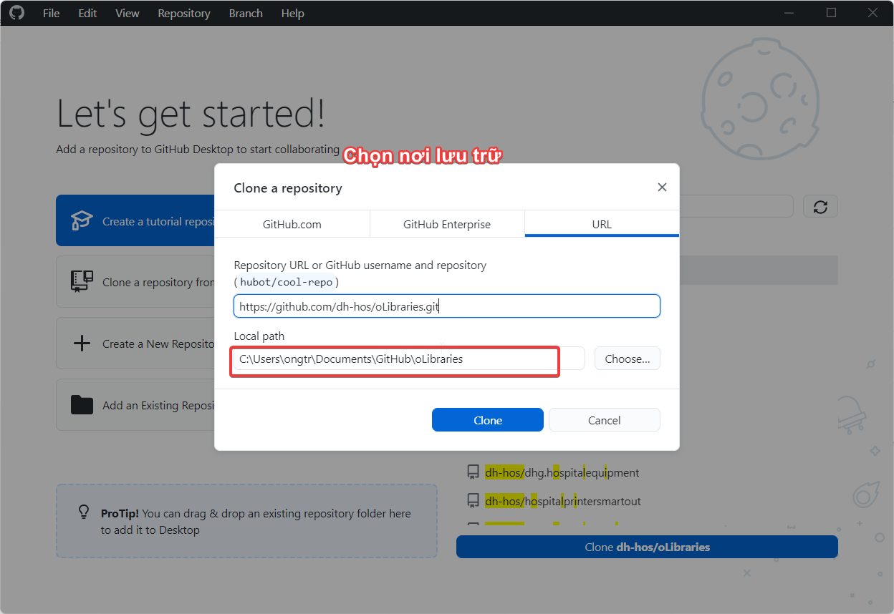

### HƯỚNG DẪN THỰC HIỆN CẬP NHẬT DLL MỚI ĐỐI VỚI DH-HOSPITAL

#### Cài đặt chương trình hỗ trợ [GitHub Desktop](https://desktop.github.com/)

#### Các bước thực hiện

##### Bước 1:

##### Bước 2:

##### Bước 3:

##### Bước 4:

##### Bước 5:

##### Bước 6:

##### Bước 7:

##### Bước 8:

