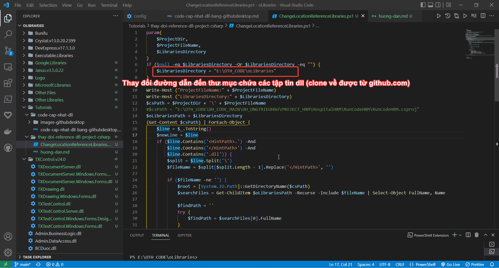
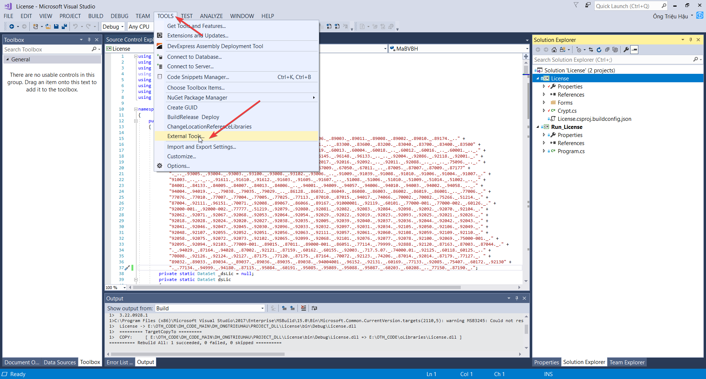
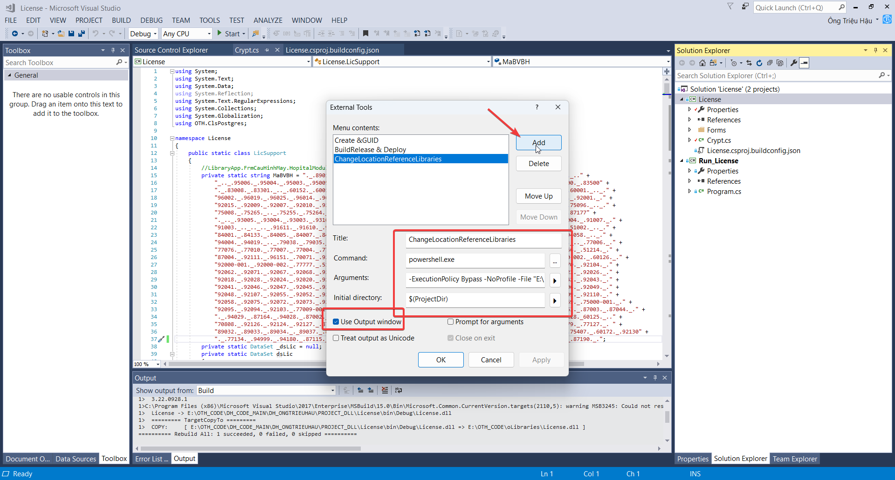
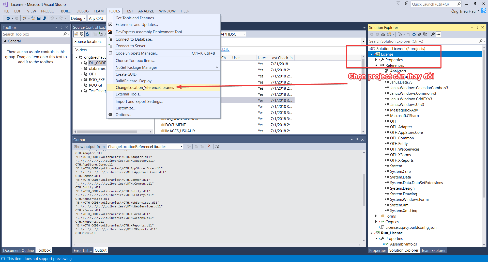
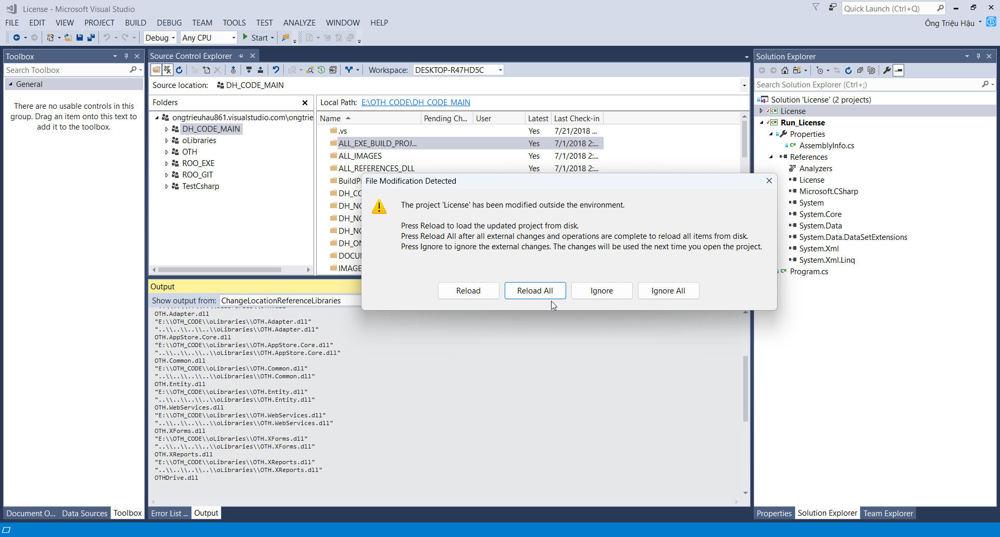
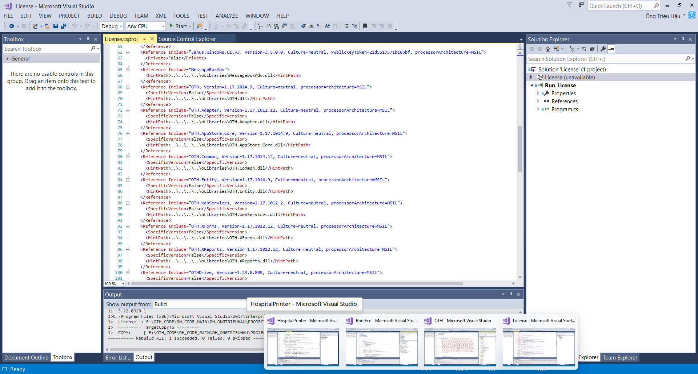
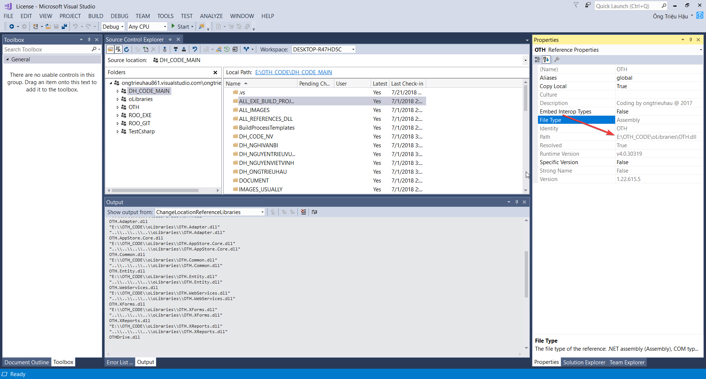

### HƯỚNG DẪN THAY ĐỔI REFENCE PATH ĐỐI VỚI CSHARP PROJECT

#### Bước 1: Thay đổi nội dung tập tin ChangeLocationReferenceLibraries.ps1

#### Bước 2 và 3: Cấu hình vào visualstudio để thực hiện

Thông tin như sau:
`Title`: `ChangeLocationReferenceLibraries`
`Command`: `powershell.exe`
`Arguments`: `-ExecutionPolicy Bypass -NoProfile -File "E:\CLOUDCODE\Github\PowerShell.All\.Net\ChangeLocationReferenceLibraries.ps1" -ProjectDir $(ProjectDir) -ProjectFileName $(ProjectFileName)`
Lưu ý: thay đường dẫn đến tập tin ChangeLocationReferenceLibraries.ps1 theo máy local
`Initial directory`: `$(ProjectDir)`

#### Bước 4: Thực hiện thay đổi

#### Bước 5: Kết quả thay đổi

